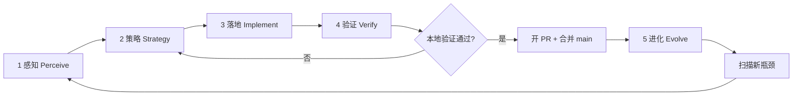

# AGENTS.md

## CoR 无限优化闭环（Infinite Optimization Loop）

本仓库的持续改进**没有终止条件**。每一轮闭环的目标不是「做完就停」，而是：**感知现状 → 选定瓶颈 → 最小落地 → 用证据验证 → 把结论写回文档与契约 → 进入下一轮**。Cloud Agent 与人类协作者都应把 `AGENTS.md` 当作活文档，每轮验证通过后更新本节或下方 Gotchas。

**顶会验证导向**：闭环优先闭合 **理论—代码—实验** 三角中的缺口（可证伪主张、可复现数字、可审计实现），而非孤立调参或文档堆砌。

**双层 Loop**（详见 [docs/LOOPS.md](docs/LOOPS.md)）：

| 循环 | 作用对象 | 典型入口 |
|------|----------|----------|
| **元循环 Meta** | 仓库工程与契约 | `make loop-perceive` / `make loop-verify`（`s1-cor/`） |
| **产品循环 Product** | CoR 训练与奖励 | `reflection_parsing.py` → `R_improve`；`grpo.py`；`run_reflection_k_ablation.py` |

元循环的「感知 / 验证」与产品循环的「反思轮次 K」共用 **先证据后改动** 的节奏，但**不要混为同一个脚本**。

**不要**为此闭环新增独立编排脚本（例如一键跑完全部阶段的 `loop_run_all.py`），除非用户明确要求。各层用 `scripts/loop_perceive.py`、`scripts/loop_verify.py` 等**单职责入口**，由 Agent 或人手工串联。

### 核心原则

| 原则 | 含义 |
|------|------|
| **先证后优** | 没有单元测试 / `validate_cor_logic` / matrix tier 证据，不改奖励公式或默认超参 |
| **理论可审计** | 每个 `theory.md` 主张须在 `docs/theory_code_matrix.yaml` 有 tier + verify 入口 |
| **主张可复现** | 论文表格数字须能追溯到 checkpoint + `eval/commands.sh` + 固定 seed/config |
| **瓶颈驱动** | 优先修「契约 partial/deferred、训练静默错误、数据不可加载」类问题，再追求 benchmark 刷分 |
| **最小改动** | 每轮只解决本轮策略选定的 1～2 个瓶颈，避免无关重构 |
| **验证通过再沉淀** | pytest / validate 通过后再更新 matrix、`AGENTS.md`、设计 doc |
| **分层对齐** | 借鉴 RL+推理文献分工：稀疏 **R_ext**（任务）、密集 **R_int**（过程）、**反思项**（跨轮 ΔQ）；不在 heuristic intrinsic 里假装已实现 token-level CoR 或双参数 φ 更新 |

### 执行前闸门：顶会价值与优化优先级（每轮必做）

**在勾选检查清单第 2 步「策略」、写代码之前**，Agent 必须先完成本闸门；若结论为「价值不足」，改选 backlog 中更高优先级项，**不得**为凑 Loop 而做低价值改动。

#### CoR 研究框架目标（理论 ↔ 实现 ↔ 实验）

| 层级 | 文献参考 | CoR 对应 | 本轮合理改动 |
|------|----------|----------|--------------|
| **主张层** | Ng reward shaping; Wei CoT | `target.md` 奖励链、内生自评 | 补齐 matrix tier、可证伪实验设计 |
| **公式层** | GRPO / PPO | `R = R_ext + λ·R_int + μ·R_improve + ν·R_converge` | `calculator.py` + 单元测试 |
| **算法层** | CoR-GRPO 双耦合 | `grpo.py` + TRL | reward_fn 正确性、多轮解析 |
| **数据层** | s1K-cor 1K | `local_data/`, HF hub | schema、load、Colab 可跑 |
| **实验层** | AIME / MATH / GPQA | `eval/commands.sh`, lm-eval | checkpoint、vLLM、ablation 脚本 |

**借鉴要点（非照搬论文）**：

- **密集信号不等于 token-level**：当前实现是链级 heuristic intrinsic；若论文强调 CoR(τ) 逐步折扣，须在 matrix 标 `deferred` 直至有实现与测试。
- **双耦合 φ**：理论有校准头演化；代码若仅 GRPO 更新 θ，实验叙述须诚实，或本轮落地最小可测代理（如 calibration ECE 曲线）。
- **外部奖励与评测一致**：训练用字符串匹配、评测用 lm-eval + 判题器时，须在 PR 中声明 gap 或对齐 grading。
- **样本效率主张**：「1K → SOTA 级」须 ablation（SFT only / +R_int / +reflection）+ 公开 checkpoint，不能只靠 README 表格。

#### 四轮自问（策略卡片必填）

在 PR 描述或本轮笔记中**用 1～2 句话**回答：

1. **层级**：本轮改的是公式/算法/数据/实验哪一层？若仅改 heuristic 权重而无 ablation → **拒绝或降级**。
2. **契约**：`docs/theory_code_matrix.yaml` 中对应项 tier 如何从 partial→implemented？verify 命令是什么？
3. **收益**：正确性、可复现性、理论闭合、还是 benchmark 数字？性能向须写明基线（SFT-only、λ=0 等）。
4. **机会成本**：同一轮是否还有更高优先级 backlog（失败测试、grpo 双计分、数据 load、Colab OOM）？

**实验向轮次**（有 GPU 时）在感知阶段额外记录：

```bash
# 训练后
bash s1-cor/eval/commands.sh   # 需 CUDA + vLLM + ckpt

# 无全量 GPU 时至少保留 CPU 证据链
cd s1-cor && python train/validate_cor_logic.py --dataset deepseek --samples 20
```

### 五层结构



---

#### 第 1 层：感知（Perceive）— 我们在哪？

**目标**：弄清理论—代码 gap、测试覆盖、数据与训练路径是否可用、论文主张是否有复现路径。

**典型动作**：

- 读契约：`docs/theory_code_matrix.yaml`、`theory.md`、`design.md`、`target.md`
- CPU 认证（Cloud VM 默认）：
  ```bash
  source /workspace/.venv/bin/activate
  cd s1-cor
  python -m pytest train/rewards/test_rewards.py train/test_grpo.py train/test_data_utils.py -v
  python train/validate_cor_logic.py --dataset deepseek --samples 10
  ```
- 对照 README [Theory-Code Mapping](README.md#theory-code-mapping) 与 matrix 中 `partial` / `deferred` / `heuristic`
- GPU 主机（若有）：`bash train/run_cor_pipeline.sh` 或分步 SFT → GRPO → `eval/commands.sh`

**产出**：简短「现状快照」— 失败测试、matrix 缺口、数据/HF 可用性、checkpoint 缺失、与论文表的差距。

---

#### 第 2 层：策略（Strategy）— 下一步改什么？

**目标**：根据感知结果排序，选定**单一**主攻方向。

**前置条件**：已完成 [执行前闸门](#执行前闸门顶会价值与优化优先级每轮必做) 四轮自问。

**决策参考**：

| 信号 | 优先策略 |
|------|----------|
| pytest / validate 失败 | 修实现或测试，更新 matrix verify |
| matrix `deferred` 且阻塞训练/论文叙述 | 最小实现或诚实降级文档 |
| `heuristic` 与论文主张冲突 | 加 ablation 或改主张表述 |
| 数据 `load_from_disk` / HF 不可用 | `data_utils`、schema、sample.json 回退 |
| Colab OOM / 缺脚本 | `sft_small.py --colab`、`colab_minimal.sh` |
| 有 ckpt 无数字 | `eval/commands.sh`、固定 config 记录 |
| 仅微调 λ/μ 无实验 | **拒绝**为主攻，除非配合 ablation 脚本 |

**产出**：本轮「策略卡片」— 1 句话目标、触及文件、预期验证命令（写入 PR 描述）。

---

#### 第 3 层：落地（Implement）— 最小正确实现

**目标**：按策略做**最小**代码/配置改动，遵循仓库既有风格。

**常见落地点**：

| 区域 | 路径 |
|------|------|
| 奖励 | `s1-cor/train/rewards/` |
| GRPO | `s1-cor/train/grpo.py`, `grpo.sh` |
| 数据 | `s1-cor/train/data_utils.py`, `local_data/` |
| SFT / Colab | `s1-cor/train/sft_small.py`, `colab_minimal.sh` |
| 评测 | `s1-cor/eval/commands.sh`, lm-eval harness |
| 契约 | `docs/theory_code_matrix.yaml` |

**禁止**：新建 `cor_optimization_loop.py` 类编排器；用 Makefile / 现有 shell 串联即可。

---

#### 第 4 层：验证（Verify）— 证据链

**目标**：正确性先于 benchmark；主张须有可重复命令。

**两层验证**：

| 层 | 机制 | 入口 |
|----|------|------|
| 单元 / 契约 | pytest + matrix `verify` | `train/rewards/test_rewards.py` 等 |
| 样本级 | 逐条 CoR 分解打印 | `validate_cor_logic.py` |
| 训练烟雾 | Colab / 小模型 SFT | `colab_minimal.sh`, `--colab` |
| 论文级 | AIME/MATH/GPQA | `eval/commands.sh`（GPU + ckpt） |

**CPU 推荐最小验证集**（Cloud Agent 默认）：

```bash
source /workspace/.venv/bin/activate
cd s1-cor
python -m pytest train/rewards/test_rewards.py train/test_grpo.py train/test_data_utils.py -v
python train/validate_cor_logic.py --dataset deepseek --samples 5
```

**合并闸门**：上述最小集在本机 **exit 0** 后方可合并涉及奖励/数据/GRPO 的 PR；全量 benchmark 失败须在 PR 中标注为「需 GPU follow-up」，不得假装已复现论文表。

---

#### 第 5 层：进化（Evolve）— 写回知识，开启下一轮

**必须更新（按影响面）**：

1. **`AGENTS.md`** — 下方「当前轮次笔记」或 Gotchas
2. **`docs/theory_code_matrix.yaml`** — tier / notes / verify 变更
3. **`theory.md` / `design.md`** — 仅当公式或算法契约变更
4. **测试** — 新行为须有 pytest 或 validate 覆盖

**本轮结束时在 PR 中写清**：瓶颈 → 策略 → 改动 → 验证结果 → **下一轮建议**。

---

### Cloud Agent 自主连续迭代协议

用户未明确喊停时，Cloud Agent **默认连续多轮 Loop**（感知 → … → 合并 → 再感知）。仍**禁止**新建 orchestrator；用手工串联现有命令与 git/PR 工具。

#### 验证通过后的自动合并

满足**全部**条件时，Agent **可自行合并** PR：

| 条件 | 要求 |
|------|------|
| 本地验证 | 第 4 层 CPU 最小验证集 exit 0（或本轮触及路径的等价命令） |
| 分支规范 | `cursor/<descriptive-name>-b3de`，已 push，`base_branch=main` |
| PR 状态 | mergeable；draft 则 `gh pr ready` |
| 合并方式 | `gh pr merge <n> --merge --delete-branch` |
| 合并后 | `git checkout main && git pull origin main` |

**不自动合并**：本地验证失败、需人工决策的冲突、用户明确「先别合并」。

**GitHub Actions**：以**本地 Loop 验证集**为准；合并后在 PR 笔记中注明 CI 状态即可。

#### 合并后 backlog 扫描

```bash
source /workspace/.venv/bin/activate
cd s1-cor
make loop-perceive    # JSON：matrix tiers + pytest + eval readiness + backlog_hints
make loop-verify      # 合并闸门等价
```

**候选优先级**：失败测试 → 训练路径错误 → matrix deferred 阻塞叙述 → 数据/Colab → benchmark 复现 → ablation 脚本。

---

### Cloud Agent 单轮检查清单

```
[ ] 0. 闸门：四轮自问 + matrix 对照
[ ] 1. 感知：`make loop-perceive` 或等价 + matrix gap
[ ] 2. 策略：`make loop-strategy` + 四轮自问
[ ] 3. 落地：最小 patch，无 orchestrator
[ ] 4. 验证：`make loop-verify`（+ GPU eval 若触及 benchmark）
[ ] 5. 开 PR：push，base=main
[ ] 6. 自动合并：本地全绿 → gh pr merge
[ ] 7. 同步 main：checkout + pull
[ ] 8. 进化：AGENTS.md 笔记 + theory_code_matrix.yaml
[ ] 9. 扫描 backlog
[ ] 10. 下一轮：新分支 cursor/...-b3de
```

### 现有工具索引（按层）

| 层 | 工具 / 路径 |
|----|-------------|
| 感知 | `docs/LOOPS.md`, `make loop-perceive`, `theory_code_matrix.yaml`, ablation / readiness 脚本 |
| 策略 | `make loop-strategy`, `target.md`, README Results / Theory-Code |
| 落地 | `train/rewards/`, `reflection_parsing.py`, `grpo.py`, `data_utils.py` |
| 验证 | `make loop-verify`, `make loop-product-verify`, `pytest train/`, `validate_cor_logic.py`, `eval/commands.sh`（GPU） |
| 进化 | **`AGENTS.md`**, `docs/LOOPS.md`, `theory_code_matrix.yaml` |
| 产品循环 | `reflection_parsing` → `R_improve`/`R_converge`；`run_reflection_k_ablation.py`（K 与阶段） |

### 当前轮次笔记（由 Agent 持续追加）

> 每合并一轮 PR，追加 3～5 行：日期、瓶颈、验证命令、下一轮建议。勿删历史。

- **基线（main + fix 分支）**：四分量奖励公式、`RewardCalculator`、GRPO `reward_fn`、33 pytest；`load_cor_dataset_from_disk` 修复 local_data；Colab `--colab` 防 OOM。
- **Loop R0（2026-06-08，闭环设计）**：建立 `docs/theory_code_matrix.yaml` 与本文「无限优化闭环」；明确 deferred：token-level CoR、φ 双耦合、benchmark 全量复现。
- **Loop R1（2026-06-11，`R_converge` + ablation）**：`ConvergenceRewardCalculator` 对齐 `target.md` `exp(-α·‖Δc‖)`；`RewardConfig.convergence_alpha`；新增 `s1-cor/scripts/run_ablation_sweep.py`（CPU λ/μ/α 扫参）。验证：pytest **36 passed**。
- **Loop R2（2026-06-11，多轮反思解析）**：`reflection_parsing.py` 从 `[Round N]`、`thinking_trajectories`、嵌入 `[Self-Rating]` 快照构建 `chain_sequence`；`validate_cor_logic` / GRPO / ablation 走 `calculate_reflection_reward`。验证：`test_reflection_parsing` + 全量 pytest。
- **Loop R3（2026-06-11，评测闸门 + K 消融）**：`check_eval_readiness.py`；`run_reflection_k_ablation.py`（K + 阶段预设）。验证：pytest **43 passed**。
- **Loop R4（2026-06-11，双层 Loop 落地）**：`docs/LOOPS.md`；`loop_perceive` / `loop_verify` + Makefile。验证：`make loop-verify`。
- **Loop R5（2026-06-11，评测复现链）**：`docs/EVAL_REPRODUCTION.md`；`compare_eval_to_paper.py`；`run_eval_smoke.sh` / `make loop-eval-smoke`；README 双层 Loop 导读。验证：`pytest train/test_compare_eval_to_paper.py` + `make loop-verify`。下一轮：GPU 训练 ckpt 后 `compare_eval_to_paper` 全 pass。
- **Loop R6（2026-06-11，R_ext 对齐 + φ 校准代理）**：`train/answer_grading.py`（boxed/sympy，对齐 lm-eval metamathqa）；`RewardConfig.use_math_grader`；`run_r_ext_alignment_report.py` / `run_calibration_report.py`；`make loop-r-ext-align` / `loop-calibration`。验证：pytest **50+ passed** + `make loop-verify`。下一轮：GPU GRPO 开 `use_math_grader` + ckpt 后 `compare_eval_to_paper`。
- **Loop R7（2026-06-11，GRPO math grader 接线）**：`CoRTrainingConfig.use_math_grader`；`USE_MATH_GRADER=1` in `grpo.sh` / `run_cor_pipeline.sh`；`run_grpo_reward_smoke.py` / `make loop-grpo-smoke`；`docs/GPU_TRAINING.md`。验证：pytest + `make loop-verify`。下一轮：GPU 主机跑 pipeline → `compare_eval_to_paper`。
- **Loop R8（2026-06-11，产品循环验证层）**：`loop_product_verify.py` / `make loop-product-verify`；`loop_perceive` 聚合 `product_loop_snapshots`；`LOOPS.md` R0–R8 索引。验证：`make loop-product-verify` + `make loop-verify`。下一轮：GPU pipeline 或 token-level CoR 诚实降级。
- **Loop R9（2026-06-11，元策略层）**：`loop_strategy.py` + `loop_matrix.py` / `make loop-strategy`；`matrix_gaps` in perceive；product verify 含 mini ablation。验证：**61+ passed** + `make loop-strategy`。下一轮：`five_dim_intrinsic` CPU 消融或 GPU `compare_eval_to_paper`。
- **Loop R10（2026-06-11，五维 R_int 消融）**：`run_intrinsic_dim_ablation.py` / `make loop-intrinsic-ablation`；`five_dim_intrinsic` heuristic→**partial**；product verify 含 mini 维度扫参。验证：**64 passed** + `make loop-product-verify`。下一轮：GPU GRPO + `compare_eval_to_paper`。
- **Loop R11（2026-06-08，R_ext 契约 + 校准 α 消融）**：`docs/TRAIN_EVAL_GRADING.md`；`calibration_metrics.compute_ece`；`run_calibration_bonus_ablation.py` / `make loop-calibration-ablation`；`external_reward`→**implemented**；`eval_openai_grader` **partial**；`calibration_proxy_phi`→**implemented**；R_ext 报告含 `recommended_training_grader`。验证：`make loop-verify` + `make loop-product-verify`（6 checks）。下一轮：GPU `USE_MATH_GRADER=1` pipeline → `compare_eval_to_paper`。
- **Loop R12（2026-06-08，eval OpenAI grader CPU 审计）**：`eval_openai_grader_audit.py`；`run_eval_openai_grader_report.py` / `make loop-eval-openai-grader`；product verify 第 7 项；`eval_openai_grader` verify 路径更新。验证：`make loop-verify` + `make loop-product-verify`（7 checks）。下一轮：GPU ckpt + `OPENAI_API_KEY` → `commands.sh` + `compare_eval_to_paper`。
- **Loop R13（2026-06-08，五维 R_int 尺度 + GRPO w_d）**：`intrinsic_weights.py`；`dimension_weights_json` / `DIMENSION_WEIGHTS_JSON` in GRPO；`run_intrinsic_scale_report.py` / `make loop-intrinsic-scale`；`docs/FIVE_DIM_INTRINSIC.md`；ablation 增 `drop_delta` / `most_sensitive_dimension`；product verify 8 项。验证：`make loop-verify` + `make loop-product-verify`。下一轮：GPU GRPO + `compare_eval_to_paper` 或 `benchmark_reproduction` 文档链。
- **Loop R14（2026-06-08，benchmark 复现 CPU 审计）**：`eval_repro_common.py`；`run_benchmark_reproduction_report.py` / `make loop-benchmark-repro`；四步 `reproduction_steps` + fixture compare；product verify 9 项。验证：`make loop-verify` + `make loop-product-verify`。下一轮：GPU ckpt + `commands.sh` → `compare_eval_to_paper` 全 pass。
- **Loop R15（2026-06-08，eval 预-OpenAI 路径对齐）**：`eval_grading_path_audit.py`；`run_eval_grading_path_report.py` / `make loop-eval-grading-path`；`openai_fallback_likely_count` 度量；product verify 10 项。验证：`make loop-verify` + `make loop-product-verify`。下一轮：GPU 全量 eval 或 `five_dim_intrinsic` 自评-启发式相关报告。

---

## Cursor Cloud specific instructions

### Product overview

This repository is an **ML research codebase** for **Chain of Reward (CoR)** / **s1** reasoning-model training. It is not a web app. Workflows are Python scripts and shell launchers. See [CoR 无限优化闭环](#cor-无限优化闭环infinite-optimization-loop) and [docs/LOOPS.md](docs/LOOPS.md) (meta + product loops). Quick: `cd s1-cor && make loop-perceive && make loop-verify`.

### Environment

- **Python**: 3.12+ with a project virtualenv at `/workspace/.venv`
- **Activate**: `source /workspace/.venv/bin/activate`
- **Package manager**: `pip` (`s1-cor/requirements.txt`)
- **GPU**: Training, vLLM inference, and full benchmark eval require CUDA. Cloud Agent VMs are CPU-only by default; use the CPU smoke tests below.

Core deps are installed with PyTorch CPU wheels. **vLLM**, **unsloth**, and **bitsandbytes** from `requirements.txt` are GPU-oriented and are not installed in the default Cloud update script.

### Local datasets

Load CoR snapshots with `load_cor_dataset_from_disk()` from `s1-cor/train/data_utils.py` (used by validation, SFT, GRPO, and MLX prep scripts). `datasets.load_from_disk` works for the bundled `local_data/s1K_cor_*` shards after the schema/metadata fixes in this repo.

### Quick verification (no GPU)

From repo root with venv activated:

```bash
# Unit + integration tests (33+ tests on fix branch)
cd s1-cor && python -m pytest train/rewards/test_rewards.py train/test_grpo.py train/test_data_utils.py -v

# CoR logic on bundled local sample
cd s1-cor && python3 -c "
import json, sys; sys.path.insert(0,'train')
from validate_cor_logic import validate_sample
from rewards import RewardCalculator, RewardConfig
from rewards.self_rating import SelfRatingExtractor
from rewards.intrinsic import IntrinsicRewardCalculator
from rewards.training_logger import CoRTrainingLogger
sample = json.load(open('local_data/s1K_cor_deepseek/sample.json'))
cfg = RewardConfig(lambda_intrinsic=1.0, self_rating_weight=0.2, calibration_bonus=0.2)
validate_sample(sample, RewardCalculator(cfg), SelfRatingExtractor(),
    IntrinsicRewardCalculator(), CoRTrainingLogger(1, False), 0)
"

# Sample-level validation
cd s1-cor && python train/validate_cor_logic.py --dataset deepseek --samples 5
```

Official README smoke test (needs HuggingFace access or working `local_data`):

```bash
cd s1-cor && python train/validate_cor_logic.py --dataset hf --samples 5
```

### Training & evaluation (GPU hosts)

See `README.md` and `s1-cor/README.md`:

| Step | Command |
|------|---------|
| Full pipeline | `bash s1-cor/train/run_cor_pipeline.sh` |
| SFT | `python s1-cor/train/sft_small.py --model_size 0.5B --dataset hf` |
| GRPO | `bash s1-cor/train/grpo.sh` |
| lm-eval setup | `cd s1-cor/eval/lm-evaluation-harness && pip install -e .[math,vllm]` |
| Benchmarks | `bash s1-cor/eval/commands.sh` |

Set `WANDB_DISABLED=true` to skip Weights & Biases during training.

### Optional services

| Service | When needed |
|---------|-------------|
| Hugging Face Hub | Model/dataset download |
| OpenAI API | MATH/GPQA grading in `eval/commands.sh` |
| Weights & Biases | Training logs (disable with `WANDB_DISABLED=true`) |
| vLLM + CUDA | Local inference and benchmark eval |

### Google Colab (minimal SFT)

Runtime: **GPU (T4)**. From `s1-cor/`:

```bash
bash train/colab_minimal.sh install   # deps only
bash train/colab_minimal.sh verify    # smoke tests
bash train/colab_minimal.sh sft       # Qwen2.5-0.5B, 1 epoch, local deepseek data
```

**pip / fsspec**: Colab may warn about `gcsfs` vs `fsspec` versions. Ignore it; do **not** force `fsspec==2025.3.0` (conflicts with `datasets==3.1.0`).

**OOM on T4**: use low-memory flags on `sft_small.py`:

```bash
python train/sft_small.py --model_size 0.5B --dataset deepseek --epochs 1 --colab
```

`--colab` sets batch=1, max_length=1024, 200 samples, fp16, and dynamic padding (not pad-to-4096).

Do **not** install `vllm` / `unsloth` on Colab for this smoke path.

### Lint / test

- **Tests**: `pytest s1-cor/train/rewards/test_rewards.py s1-cor/train/test_grpo.py s1-cor/train/test_data_utils.py`
- **Theory contract**: `docs/theory_code_matrix.yaml`
- **No project-level linter** configured at repo root; vendored `lm-evaluation-harness` has its own pre-commit config.

### Gotchas

- **Theory vs code**: Heuristic intrinsic rewards and chain-level (not token-level) CoR are documented in `docs/theory_code_matrix.yaml`. Do not claim full paper theory is implemented without checking tiers.
- **Dual coupling φ**: GRPO updates θ only; calibration quality is implicit via reward, not a separate φ head.
- **Benchmark reproduction**: Paper table numbers require trained checkpoints + GPU eval; not runnable on CPU-only Cloud VMs.
- **Continuous loop**: Follow [CoR 无限优化闭环](#cor-无限优化闭环infinite-optimization-loop); merge locally verified PRs then rescan backlog.

See [README.md](README.md) for installation and results.
