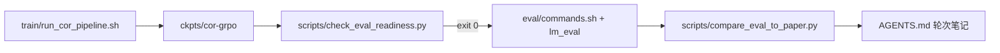

# Benchmark 复现闭环（GPU）

将 **产品循环**（训练出 ckpt）与 **元循环**（证据对比论文表）接到 README / design.md §9 数字。

## 流程（Loop R5+）



## 1. 训练（GPU）

```bash
cd s1-cor
export WANDB_DISABLED=true
export USE_MATH_GRADER=1   # 推荐：训练 R_ext 与 lm-eval 数学判题对齐
bash train/run_cor_pipeline.sh
# 或分步: SFT → USE_MATH_GRADER=1 bash train/grpo.sh → 记下 ckpts/cor-grpo-<uid>
```

详见 [GPU_TRAINING.md](GPU_TRAINING.md)。

Colab / 小 GPU 烟雾：`python train/sft_small.py --colab`（不产出 32B 论文数字）。

## 2. 闸门（CPU 或 GPU 均可）

```bash
cd s1-cor
python scripts/check_eval_readiness.py
# 全部 ✅ 时 exit 0
```

典型 blockers：无 CUDA、无 `ckpts/*/config.json`、未装 lm_eval、无 `OPENAI_API_KEY`。

安装 lm-eval harness：

```bash
cd s1-cor/eval/lm-evaluation-harness
pip install -e ".[math]"    # CPU smoke / 解析
pip install -e ".[math,vllm]"  # 完整 vLLM 评测
```

## 3. 运行评测（GPU + vLLM）

```bash
cd s1-cor/eval/lm-evaluation-harness
export OPENAI_API_KEY=...
# 编辑 ../commands.sh 中 pretrained= 指向你的 ckpt
bash ../commands.sh   # 或复制其中 lm_eval 行
```

`commands.sh` 主任务：`aime24_nofigures`, `openai_math`, `gpqa_diamond_openai`。

## 4. 对比论文表

```bash
cd s1-cor
python scripts/compare_eval_to_paper.py --results-dir /path/to/lm_eval/output
python scripts/compare_eval_to_paper.py --results path/to/results.json --json
```

目标（CoR-32B, 1K samples）：

| Benchmark | Target |
|-----------|--------|
| AIME24 | 56.7 |
| MATH500 | 93.0 |
| GPQA | 59.6 |

## 5. CPU 烟雾（无 GPU）

验证 harness 可运行，**不**代表论文数字：

```bash
cd s1-cor
make loop-eval-smoke
```

## 与双层 Loop 的关系

| Loop | 本页对应步骤 |
|------|----------------|
| Meta | `check_eval_readiness` → `compare_eval_to_paper` → 更新 AGENTS / matrix |
| Product | `run_cor_pipeline` → 反思 + GRPO → ckpt |

见 [LOOPS.md](LOOPS.md)、[AGENTS.md](../AGENTS.md)。
