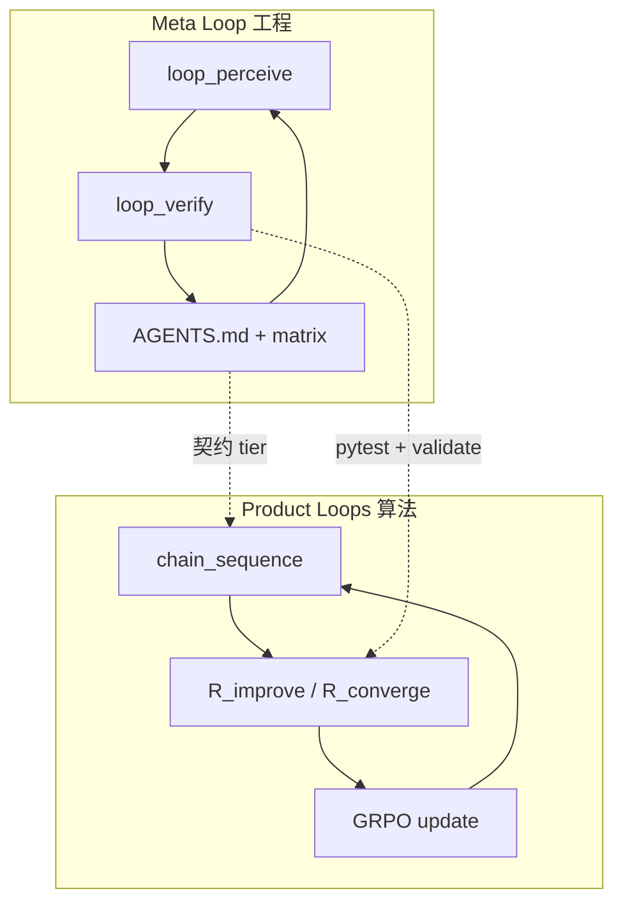

# Loops：双层闭环如何贯穿本仓库

CoR 项目里 **Loop** 有两层含义，共用同一套「感知 → 行动 → 证据 → 沉淀」节奏，但作用对象不同。

## 1. 元循环（Meta Loop）— 仓库如何持续变好

**谁用**：Cloud Agent、维护者、写论文前的工程审计。

**目标**：闭合 `theory.md` ↔ 代码 ↔ `eval/commands.sh` 三角，无终止条件。

| 层 | 动作 | 本仓库入口 |
|----|------|------------|
| 1 感知 | 测试、契约、readiness | `python scripts/loop_perceive.py --json` |
| 2 策略 | 选 1 个瓶颈 + 四轮自问 | `AGENTS.md` 闸门、`docs/theory_code_matrix.yaml` |
| 3 落地 | 最小 patch | `train/`、`scripts/` |
| 4 验证 | 证据链 exit 0 | `python scripts/loop_verify.py` |
| 5 进化 | 写回文档与 matrix | `AGENTS.md` 当前轮次笔记 |

**禁止**：`loop_run_all.py` 一类一键编排器。各层是**独立脚本**，由人或 Agent **手工串联**（见 `Makefile` 的 `loop-perceive` / `loop-verify`，不是 `loop-all`）。

## 2. 产品循环（Product Loops）— CoR 如何训练与变聪明

**谁用**：训练脚本、奖励模块、论文叙述。

| Loop | 含义 | 代码 |
|------|------|------|
| **奖励链** | 密集 `R_int` 沿思考过程 | `rewards/intrinsic.py`（链级；token-level 仍 deferred） |
| **反思环** | `c_k → c_{k+1}`，`R_improve` / `R_converge` | `reflection_parsing.py` → `calculate_reflection_reward` |
| **GRPO 环** | 策略 θ 随组相对优势更新 | `grpo.py` + TRL |
| **双耦合** | CoR 信号 ↔ 策略（φ 头 deferred） | `theory.md` §5–6 |

反思深度 **K** 与 design.md 三阶段（SFT → +CoR → +Reflection）的 CPU 代理：

```bash
cd s1-cor
python scripts/run_reflection_k_ablation.py --json
```

GPU 论文数字闭环：

```bash
python scripts/check_eval_readiness.py   # 闸门
# exit 0 后
cd eval/lm-evaluation-harness && bash ../commands.sh
```

## 3. 两层如何对齐



- **元循环**保证：声称 implemented 的公式在测试里真有。
- **产品循环**保证：训练时多轮反思与奖励公式一致。
- **消融脚本**是两层之间的桥：在 CPU 上预览 K / λ / μ，在 GPU 上跑 benchmark。

## 4. 快速命令

```bash
cd s1-cor
make loop-perceive    # 感知 JSON
make loop-verify      # 验证层（合并闸门）
make loop-ablation    # λ/μ/α + K + 阶段预设
```

详见 [AGENTS.md](../AGENTS.md) 无限优化闭环章节。
