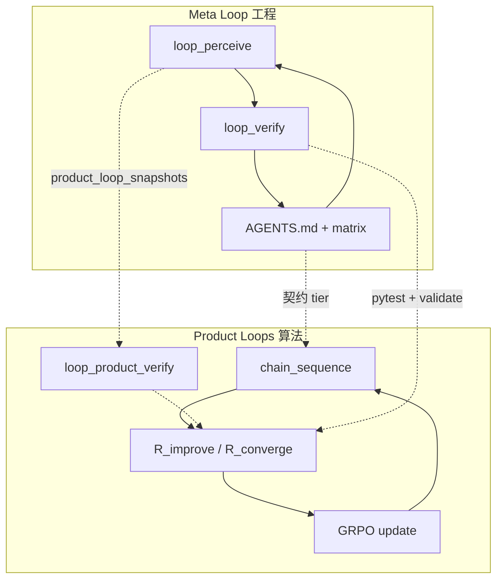

# Loops：双层闭环如何贯穿本仓库

CoR 项目里 **Loop** 有两层含义，共用同一套「感知 → 行动 → 证据 → 沉淀」节奏，但作用对象不同。

## 1. 元循环（Meta Loop）— 仓库如何持续变好

**谁用**：Cloud Agent、维护者、写论文前的工程审计。

**目标**：闭合 `theory.md` ↔ 代码 ↔ `eval/commands.sh` 三角，无终止条件。

| 层 | 动作 | 本仓库入口 |
|----|------|------------|
| 1 感知 | 契约、readiness、**产品循环快照** | `make loop-perceive` |
| 2 策略 | 选 1 个瓶颈 + 四轮自问 | `make loop-strategy` |
| 3 落地 | 最小 patch | `train/`、`scripts/` |
| 4 验证 | pytest + validate（合并闸门） | `make loop-verify` |
| 5 进化 | 写回文档与 matrix | `AGENTS.md` 当前轮次笔记 |

`loop_perceive` 默认 `--skip-pytest`（pytest 由 `loop_verify` 负责）；`product_loop_snapshots` 聚合 GRPO / R_ext / 校准代理指标。

**禁止**：`loop_run_all.py` 一类一键编排器。各层是**独立脚本**，由人或 Agent **手工串联**。

## 2. 产品循环（Product Loops）— CoR 如何训练与变聪明

**谁用**：训练脚本、奖励模块、论文叙述。

| Loop | 含义 | 代码 |
|------|------|------|
| **奖励链** | 密集 `R_int` 沿思考过程 | `rewards/intrinsic.py`（链级；token-level 仍 deferred） |
| **反思环** | `c_k → c_{k+1}`，`R_improve` / `R_converge` | `reflection_parsing.py` → `calculate_reflection_reward` |
| **GRPO 环** | 策略 θ 随组相对优势更新 | `grpo.py` + TRL |
| **双耦合** | CoR 信号 ↔ 策略（φ 头 deferred） | `theory.md` §5–6 |

**产品循环验证层**（Layer 4，与 meta `loop_verify` 并列，不替代）：

```bash
cd s1-cor
make loop-product-verify   # grpo smoke + R_ext align + calibration proxy
```

反思深度 **K** 与 design.md 三阶段（SFT → +CoR → +Reflection）的 CPU 代理：

```bash
python scripts/run_reflection_k_ablation.py --json
make loop-ablation
```

GPU 论文数字闭环（详见 [EVAL_REPRODUCTION.md](EVAL_REPRODUCTION.md)、[GPU_TRAINING.md](GPU_TRAINING.md)）：

```bash
export USE_MATH_GRADER=1
bash train/run_cor_pipeline.sh
python scripts/check_eval_readiness.py   # 闸门 → exit 0
cd eval/lm-evaluation-harness && bash ../commands.sh
python scripts/compare_eval_to_paper.py --results-dir <output>
```

CPU：`make loop-eval-smoke`（dummy lm_eval，非论文分数）。

## 3. 两层如何对齐



- **元循环**保证：声称 implemented 的公式在测试里真有。
- **产品循环**保证：训练时多轮反思与奖励公式一致。
- **消融脚本**是两层之间的桥：在 CPU 上预览 K / λ / μ，在 GPU 上跑 benchmark。

## 4. 快速命令

```bash
cd s1-cor
make loop-perceive        # 元感知 JSON（含 product_loop_snapshots + matrix_gaps）
make loop-strategy        # 元策略：排序后的契约缺口 + strategy_card
make loop-verify          # 元验证（合并闸门）
make loop-product-verify  # 产品循环 CPU 证据（含 mini ablation）
make loop-ablation        # λ/μ/α + K + 阶段预设
make loop-r-ext-align     # R_ext string vs math grader
make loop-calibration     # φ ECE proxy
make loop-calibration-ablation  # calibration_bonus α 扫参
make loop-intrinsic-ablation  # 五维 R_int w_d 消融
make loop-intrinsic-scale     # R_ext vs R_int 尺度
make loop-eval-openai-grader  # MATH/GPQA OpenAI grader CPU audit
make loop-grpo-smoke      # GRPO reward_fn 预检
make loop-eval-smoke      # lm_eval dummy
make loop-intrinsic-correlation  # 自评 vs 启发式 r_d
make loop-eval-grading-path   # 训练 vs eval 预-OpenAI 路径
make loop-deferred-claims    # deferred 理论诚实审计
make loop-publication-ready  # 顶会投稿 doc/claim 审计
make loop-benchmark-repro # 论文复现 CPU 审计链
make loop-05b-theory      # 0.5B 理论阶梯 CPU 代理（R19）
```

0.5B 最小尺度理论验证（CPU 代理 + GPU 入口）见 [MODEL_05B_TEST.md](MODEL_05B_TEST.md)。

## 5. Loop 轮次索引（R0–R19）

| 轮次 | 主题 | 关键入口 |
|------|------|----------|
| R0 | 契约 + AGENTS 闭环 | `theory_code_matrix.yaml` |
| R1 | R_converge + ablation | `run_ablation_sweep.py` |
| R2 | 多轮反思解析 | `reflection_parsing.py` |
| R3 | eval readiness + K 消融 | `check_eval_readiness.py` |
| R4 | 双层 Loop 文档 | `LOOPS.md`, `loop_perceive/verify` |
| R5 | 评测复现链 | `compare_eval_to_paper.py` |
| R6 | R_ext math + φ 代理 | `answer_grading.py`, `run_calibration_report.py` |
| R7 | GRPO math grader 接线 | `USE_MATH_GRADER`, `GPU_TRAINING.md` |
| R8 | 产品循环验证层 | `loop_product_verify.py` |
| R9 | 元策略层 | `loop_strategy.py`, `loop_matrix.py` |
| R10 | 五维 R_int 消融 | `run_intrinsic_dim_ablation.py` |
| R11 | R_ext 契约 + α 校准消融 | `TRAIN_EVAL_GRADING.md`, `run_calibration_bonus_ablation.py` |
| R12 | eval OpenAI grader CPU 审计 | `run_eval_openai_grader_report.py`, `eval_openai_grader_audit.py` |
| R13 | 五维 R_int 尺度 + GRPO w_d | `intrinsic_weights.py`, `run_intrinsic_scale_report.py`, `FIVE_DIM_INTRINSIC.md` |
| R14 | benchmark 复现 CPU 审计链 | `run_benchmark_reproduction_report.py`, `eval_repro_common.py` |
| R15 | eval 预-OpenAI 判题路径对齐 | `run_eval_grading_path_report.py`, `eval_grading_path_audit.py` |
| R16 | 自评 vs 启发式 R_int 相关 | `run_self_rating_intrinsic_correlation_report.py` |
| R17 | deferred 理论诚实契约 | `DEFERRED_CLAIMS.md`, `run_deferred_claims_report.py` |
| R18 | 顶会投稿 readiness | `PUBLICATION_READINESS.md`, `loop-publication-ready` |
| R19 | 0.5B 理论阶梯验证 | `run_05b_theory_verify.py`, `grpo_05b.sh`, `MODEL_05B_TEST.md` |

详见 [AGENTS.md](../AGENTS.md) 无限优化闭环章节。
